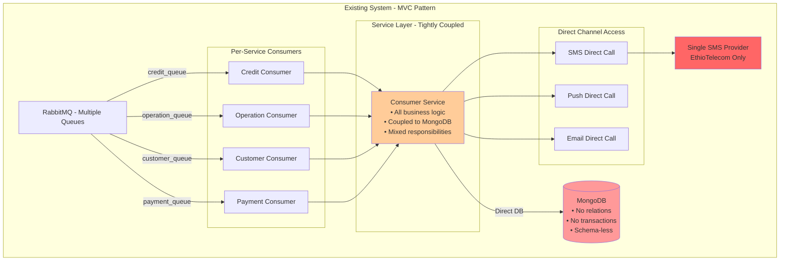
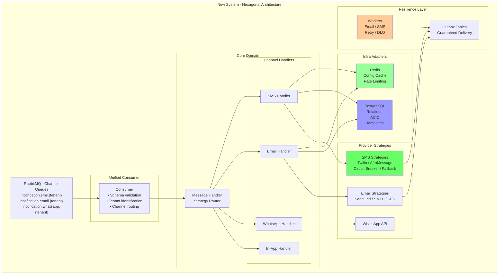
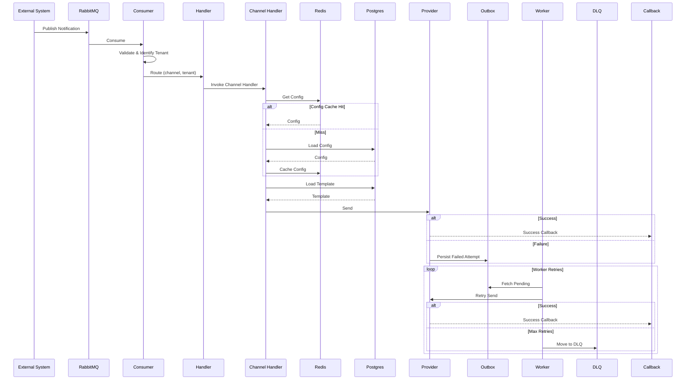

<!-- Slide 1 -->
# Multi-Tenant Notification Service
## From Coupled MVC to Hexagonal Resilient Platform

Objective: Adopt a scalable, resilient, testable architecture supporting multi-tenancy & multi-provider delivery.

---

<!-- Slide 2 -->
## Executive Summary

| Aspect | Existing System | New Hexagonal System | Winner |
|--------|----------------|----------------------|---------|
| **Architecture** | MVC + Event-Driven | Hexagonal (Ports & Adapters) + DDD | ✅ New |
| **Database** | MongoDB | PostgreSQL + Redis | ✅ New |
| **Message Queue** | RabbitMQ (per-service queues) | RabbitMQ (per-channel queues) | ✅ New |
| **Code Maintainability** | Medium (coupled) | High (loosely coupled) | ✅ New |
| **Scalability** | Limited (vertical) | Excellent (horizontal) | ✅ New |
| **Testability** | Low (tight coupling) | High (dependency injection) | ✅ New |
| **Performance** | Good | Excellent | ✅ New |
| **Multi-tenancy** | None | Full support | ✅ New |
| **Provider Fallback** | No | Yes (circuit breaker) | ✅ New |
| **Revenue Model** | Cost center | Profit center potential | ✅ New |

Why now: Scale demands, reliability gaps, cost savings , revenue opportunity.

---

<!-- Slide 3 -->
## Existing Architecture (Diagram)



---

<!-- Slide 4 -->
## Existing Pain Points

- ❌ **N consumer implementations** for N services
- ❌ **Tight coupling** between service layer and MongoDB
- ❌ **No separation** of concerns
- ❌ **Hard to test** due to direct dependencies
- ❌ **Single SMS provider** - no fallback
- ❌ **No multi-tenancy** support
- ❌ **Mixed responsibilities** in consumer service

---

<!-- Slide 5 -->
## New Hexagonal Architecture (Diagram)



---

<!-- Slide 6 -->
## End-to-End Sequence (Reliability)



---
<!-- Slide 7 -->
## Key Improvements 

- ✅ **Single consumer** for all services
- ✅ **Loose coupling** via dependency injection
- ✅ **Clear separation** of concerns (Domain, Application, infrastructure)
- ✅ **Highly testable** with interface mocking
- ✅ **Multi-provider** with automatic fallback
- ✅ **Full multi-tenancy** support
- ✅ **Worker services** for guaranteed delivery
- ✅ **Circuit breakers** for resilience
  
<!-- Slide 8 -->
## Message Contract & Queue Naming

**Queue Pattern:** `notification.{channel}.{tenant}`
Examples: `notification.sms.qena`, `notification.email.qena`

```json
{
  "serviceName": "payment",
  "recipient": { "address": "0913327219" },
  "templateName": "transaction_alert",
  "payload": {
    "transactionNo": "TXN123456",
    "amount": "1000.00",
    "accountNumber": "1000022333",
    "balance": "5000.00",
    "transactionType": "CREDIT"
  },
  "idempotencyKey": "payment-txn-123456",
  "lang":"en",
  "api-keys":"qena_ndjnkndkmldmAnbdn6999bjbntcf_keys"
}
```

---

<!-- Slide 98 -->
## Data & Multi-Tenancy

- Postgres: tenants, templates (JSONB multi-language), outbox, callbacks
- Constraints & FKs guarantee integrity; unique (tenant_id, template_key)
- Redis: hot config, rate limiting, performance (10–20ms access)
- Eager includes prevent N+1 (template, template.tenant)
  
---

<!-- Slide 10 -->
## Scalability, Reliability & Resilience Components

- Outbox pattern: eventual consistency & guaranteed delivery
- Workers: exponential backoff retries; DLQ for permanent failures
- Circuit breakers + provider fallback chains
- Idempotency keys & structured audit logging
- Per-channel queue scaling; independent autoscaling per channel
<!-- Slide 11 -->
## Security & Compliance

- Multi-tenant API keys (`nt_{tenant}_{secret}`); strict isolation
- Per-tenant rate limits; PII masking & encrypted at rest
- Audit trails + correlation IDs; GDPR/SOC2-ready retention
- Circuit breakers reduce abuse impact

---

<!-- Slide 12 -->
## Migration Plan (3 Phases)

1. Phase 1: Roll out Repository + UoW + Provider Strategies + Redis config
2. Phase 2: Pilot on SMS then In-APP Notification
3. Phase 3: Enable Outbox + Workers + DLQ dashboards; extend to other channels

---

<!-- Slide 13 -->
## Risks & Mitigations

| Risk | Mitigation |
|------|------------|
| Migration complexity | Phased rollout, feature flags |
| Query performance | Indexes, query plan review, tracing |
| Provider limits/outages | Rate limiting + fallback chain + circuit breaker |
| Cache staleness | TTL, cache-aside, invalidation hooks | 
---

<!-- Slide 14 -->
## Team Impact & Changes

- Publish using channel queues + standard message contract
- Use Repo + Spec + UoW + BaseService patterns for data access
- Add metrics/traces; follow retry & idempotency guidelines
- DevOps: autoscaling policies, dashboard for outbox/DLQ
  
---

## Thank You
